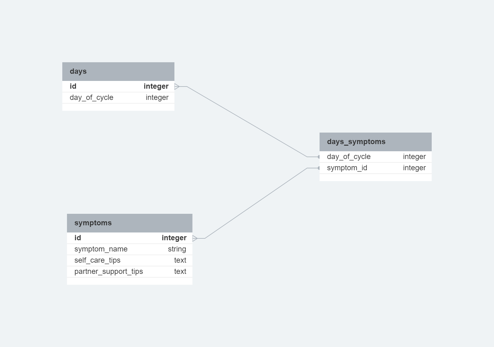

# CycleSavvy Web App - MVP

## Setup

### Dependencies

- Run `npm install` in project directory. This will install server-related dependencies such as `Express`.
- `cd client` and run `npm install`. This will install client dependencies (`React`).

### Database Prep

- Access the MySQL interface in your terminal by running `mysql -u root -p`
- Create a new database called cycle: `create database cycle`
- Add a `.env` file to the project folder of this repository containing the MySQL authentication information for MySQL user. For example:

```bash
  DB_HOST=localhost
  DB_USER=root
  DB_NAME=cycle
  DB_PASS=YOURPASSWORD
```

- Run `npm run migrate` in the project folder of this repository, in a new terminal window. This will create 3 tables called 'symptoms', 'days', and 'days_symptoms' in your database.

**Database Schema**



### Development

- Run `npm start` in project directory to start the Express server on port 4000
- In another terminal, do `cd client` and run `npm start` to start the client in development mode with hot reloading in port 5173.

:herb:
